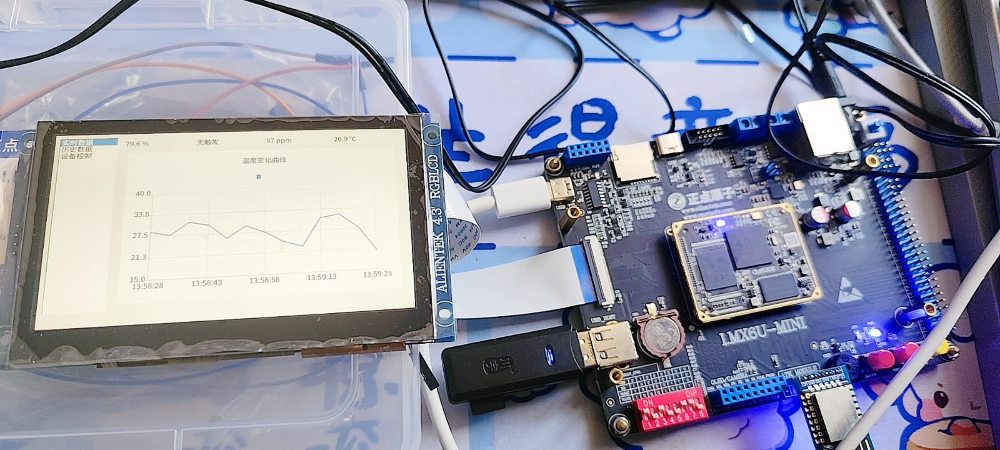
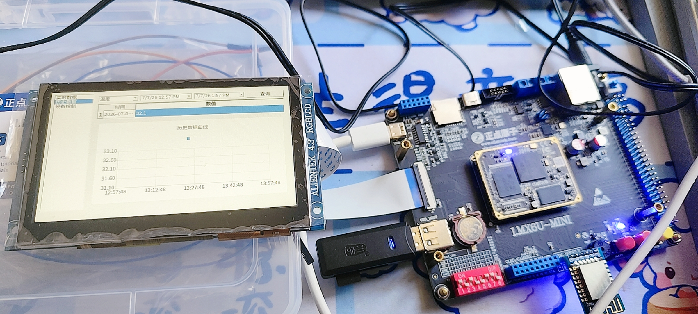
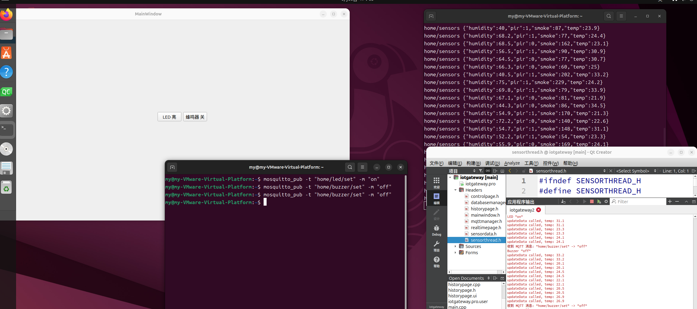

# iotgateway

基于 Qt5 的嵌入式 Linux 物联网网关图形界面程序。项目已在 i.MX6U 开发板上运行，主要实现传感器数据展示、实时曲线、历史数据存储、LED/蜂鸣器控制以及 MQTT 数据上报和远程控制。

## 技术栈

| 方向 | 技术 |
| --- | --- |
| 开发语言 | C++11 |
| 图形界面 | Qt5 Widgets、Qt Designer、`.ui` |
| 页面结构 | `QListWidget`、`QStackedWidget` |
| 多线程 | `QThread`、Qt 信号槽 |
| 图表 | Qt Charts |
| 数据库 | Qt SQL、SQLite |
| 网络通信 | Qt MQTT |
| 硬件控制 | Linux LED class、GPIO sysfs |
| 构建工具 | qmake、Makefile |
| 运行平台 | i.MX6U 嵌入式 Linux、Linux 桌面、Windows 桌面 |

## 功能说明

- 实时数据页面：显示温度、湿度、烟雾浓度、人体红外状态。
- 实时曲线：使用 Qt Charts 绘制温度变化曲线。
- 历史数据页面：从 SQLite 查询历史传感器数据并绘制曲线。
- 设备控制页面：本地按钮控制 LED 和蜂鸣器。
- MQTT 上报：将传感器数据以 JSON 格式发布到 `home/sensors`。
- MQTT 控制：订阅 `home/led/set` 和 `home/buzzer/set`，接收 `on` / `off` 指令。
- 多线程采集：采集线程定时生成模拟数据，通过信号槽分发给 UI、数据库和 MQTT 模块。
- 板端控制：在 i.MX6U 上通过 Linux LED class / GPIO sysfs 控制真实 LED 和蜂鸣器。

## 运行效果

### 实时数据页面



### 历史数据页面



### 设备控制页面



## 模块结构

| 模块 | 文件 | 说明 |
| --- | --- | --- |
| 主窗口 | `mainwindow.*`、`mainwindow.ui` | 初始化页面、菜单、数据库、MQTT 和采集线程 |
| 实时页面 | `realtimepage.*`、`realtimepage.ui` | 显示实时传感器数据和温度曲线 |
| 历史页面 | `historypage.*`、`historypage.ui` | 查询 SQLite 历史数据并绘制曲线 |
| 控制页面 | `controlpage.*`、`controlpage.ui` | 控制 LED 和蜂鸣器 |
| 采集线程 | `sensorthread.*` | 定时生成传感器数据 |
| 数据库 | `databasemanager.*` | 创建表、保存数据、查询历史数据 |
| MQTT | `mqttmanager.*` | 连接 Broker、发布数据、订阅控制主题 |
| 数据结构 | `sensordata.h` | 定义传感器数据结构 |

## 项目结构

```text
iot
├── README.md
├── iotgateway/
│   ├── iotgateway.pro
│   ├── main.cpp
│   ├── mainwindow.*
│   ├── realtimepage.*
│   ├── historypage.*
│   ├── controlpage.*
│   ├── databasemanager.*
│   ├── mqttmanager.*
│   └── sensorthread.*
└── build-iotgateway-Desktop_Qt_5_12_9_GCC_64bit-Debug/
    ├── iotgateway
    └── gateway.db
```

## 数据流

```text
SensorThread
    ├── newSensorData -> RealtimePage        # 刷新实时数值和曲线
    ├── newSensorData -> DatabaseManager     # 写入 SQLite
    └── newSensorData -> MqttManager         # 发布 MQTT

MqttManager
    ├── home/led/set    -> ControlPage::setLed()
    └── home/buzzer/set -> ControlPage::setBuzzer()
```

## MQTT 主题

| 方向 | 主题 | 数据 |
| --- | --- | --- |
| 发布 | `home/sensors` | 传感器 JSON 数据 |
| 订阅 | `home/led/set` | `on` / `off` |
| 订阅 | `home/buzzer/set` | `on` / `off` |

传感器上报示例：

```json
{"temp":25.3,"humidity":61.2,"smoke":120,"pir":1}
```

## SQLite 数据表

数据库文件名：

```text
gateway.db
```

表结构：

```sql
CREATE TABLE IF NOT EXISTS sensor_data (
    id INTEGER PRIMARY KEY AUTOINCREMENT,
    timestamp DATETIME DEFAULT CURRENT_TIMESTAMP,
    type TEXT NOT NULL,
    value REAL NOT NULL
);
```

每轮采集写入 4 条记录：

- `temperature`
- `humidity`
- `smoke`
- `pir`

## i.MX6U 板端说明

项目已移植到 i.MX6U 嵌入式 Linux 平台运行。板端主要注意以下内容：

- 使用 i.MX6U 对应 Qt5 运行环境。
- 根据实际网络环境修改 MQTT Broker 地址。
- LED 通过 Linux LED class 控制，例如写入：

```text
/sys/class/leds/<led-name>/brightness
```

- 蜂鸣器通过 GPIO sysfs 控制，例如：

```text
/sys/class/gpio/gpioN/direction
/sys/class/gpio/gpioN/value
```

控制逻辑由 `ControlPage` 统一处理，本地按钮和 MQTT 指令最终调用同一套 LED/蜂鸣器控制接口。

## 环境要求

Qt 模块：

- `core`
- `gui`
- `widgets`
- `charts`
- `sql`
- `mqtt`

其他依赖：

- C++ 编译器
- qmake
- make
- Qt SQLite 驱动
- 可选：Mosquitto 或其他 MQTT Broker

## Linux 下构建运行

当前工程使用 Qt 5.12.9 测试：

```bash
cd /home/my/Qt/iot
mkdir -p build-iotgateway-Desktop_Qt_5_12_9_GCC_64bit-Debug
cd build-iotgateway-Desktop_Qt_5_12_9_GCC_64bit-Debug
/home/my/Qt5.12.9/5.12.9/gcc_64/bin/qmake ../iotgateway/iotgateway.pro -spec linux-g++ CONFIG+=debug
make -j$(nproc)
./iotgateway
```

如果系统默认 `qmake` 已安装 Qt Charts、Qt SQL 和 Qt MQTT，也可以使用：

```bash
cd /home/my/Qt/iot
mkdir -p build
cd build
qmake ../iotgateway/iotgateway.pro
make -j$(nproc)
./iotgateway
```

程序使用相对路径创建 `gateway.db`，建议在构建目录中启动。

## Qt Creator 运行

1. 打开 Qt Creator。
2. 打开 `iotgateway/iotgateway.pro`。
3. 选择对应 Qt Kit。
4. 点击 `Build`。
5. 点击 `Run`。

## Windows 下构建运行

Windows 下需要使用 Windows 版 Qt 重新构建，不能直接运行 Linux 可执行文件。

Qt Creator 方式：

1. 安装 Qt 5.12.9 或兼容版本。
2. 安装 Qt Charts、Qt MQTT、Qt SQL。
3. 打开 `iotgateway/iotgateway.pro`。
4. 选择 MinGW 或 MSVC Kit。
5. 构建并运行。

命令行方式：

```bat
cd /d D:\path\to\iot
mkdir build
cd build
qmake ..\iotgateway\iotgateway.pro
mingw32-make
iotgateway.exe
```

单独发布 exe 时可使用：

```bat
windeployqt iotgateway.exe
```

## MQTT 测试

Linux 安装 Mosquitto：

```bash
sudo apt install mosquitto mosquitto-clients
sudo systemctl enable --now mosquitto
```

订阅传感器数据：

```bash
mosquitto_sub -h localhost -t 'home/sensors'
```

发送 LED 控制：

```bash
mosquitto_pub -h localhost -t 'home/led/set' -m on
mosquitto_pub -h localhost -t 'home/led/set' -m off
```

发送蜂鸣器控制：

```bash
mosquitto_pub -h localhost -t 'home/buzzer/set' -m on
mosquitto_pub -h localhost -t 'home/buzzer/set' -m off
```

## 常见问题

### 编译时报 Unknown module(s) in QT: mqtt 或 charts

当前 Qt Kit 没有安装 Qt MQTT 或 Qt Charts。需要在 Qt Maintenance Tool 中安装对应模块，或切换到已安装模块的 Qt Kit。

### 启动后找不到 Qt 库

Linux 下可临时设置 Qt 库路径：

```bash
export LD_LIBRARY_PATH=/home/my/Qt5.12.9/5.12.9/gcc_64/lib:$LD_LIBRARY_PATH
./iotgateway
```

### 数据库文件在哪里

数据库路径取决于程序启动时的当前工作目录。推荐从构建目录或 Qt Creator 启动。

### 没有 MQTT Broker 能否运行

可以。MQTT 连接失败只影响数据上报和远程控制，实时页面、历史数据和本地控制仍可运行。
